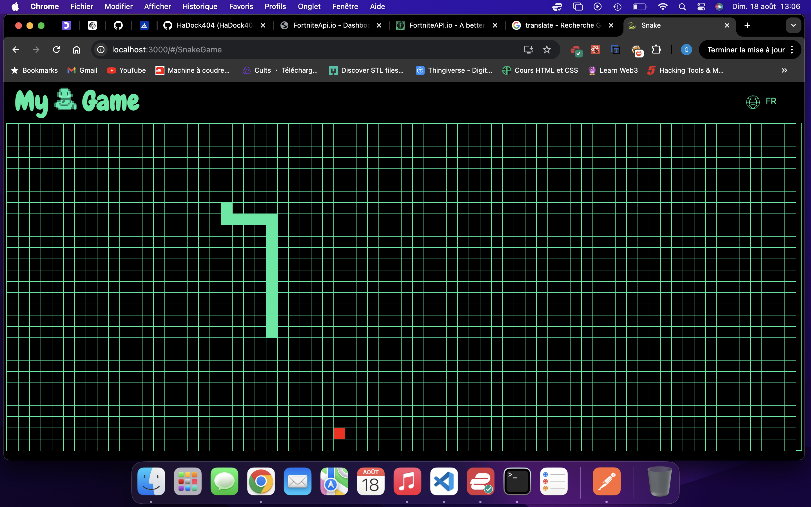

# APP Snake Game

[](LICENSE)

Here is my Snake application which allows you to play the Snake game on a web page using the user's keyboard keys.   

## Description  

This simple game is made with React and distributed with the Github Page. Different sensors make it possible to recover the movements of the snake, then are sent to an API allowing the players' playing methods to be analyzed in order to carry out a gameplay study.  



## Table of Contents

- [Getting Started](#Getting-Started)
- [Launch Application](#Launch-Application)
- [Contributing](#Contributing)
- [License](#License)  

## Getting Started    

```bash
git clone https://github.com/HaDock404/app-game-snake.git
cd app-game-snake
npm install
```  

## Launch Application    

```bash
npm start
```  

## Contributing

Pull requests are welcome. For major changes, please open an issue first
to discuss what you would like to change.

Please make sure to update tests as appropriate.

## License  

This project is licensed under the MIT License - see the [LICENSE](./LICENSE) file for details.